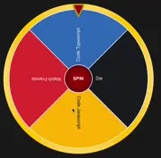

# Roletinha (Wheely)

This is a spinning wheel app, you can set up all the items in the wheel, their weight (how many times it will appear in the wheel) and a color.

## Overview

This was built with Vite and bun as package manager.

### Running it

```sh
bun run dev
```

## TO-DO

- [x] Deploy
- [ ] Persistent URL
- [x] Export and Import your wheely
- [ ] OBS overlay
- [ ] Live stream platforms integrations
